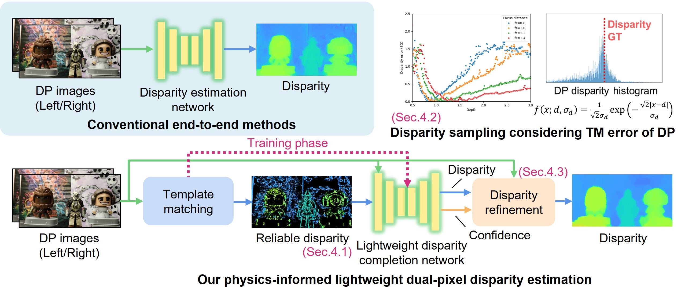
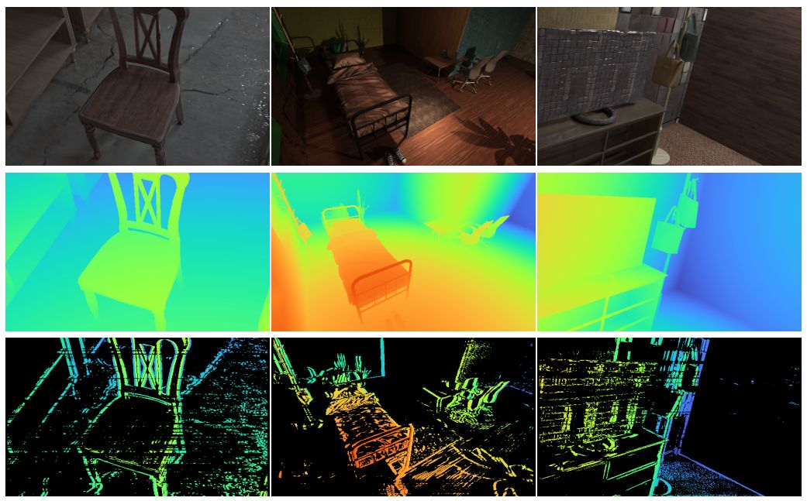

# Revisiting Disparity from Dual-Pixel Images: Physics-Informed Lightweight Depth Estimation (WACV 2025)
Teppei Kurita, Yuhi Kondo, Legong Sun, Takayuki Sasaki, Sho Nitta, Yasuhiro Hashimoto, Yoshinori Muramatsu and Yusuke Moriuchi\
Sony Semiconductor Solutions Corporation, Tokyo, Japan\
paper([arxiv](https://arxiv.org/abs/2411.04714)) | [dataset](#dataset)\


## Contents
1. [Dependencies](#dependencies)
2. [Directory Structure](#directory-structure)
3. [Commands](#commands)
4. [Dataset](#dataset)
5. [Docker Usage](#docker-usage)

## Dependencies
The dependencies required to run this project are as follows:
- Python 3.7+
- PyTorch 1.9.1
- CUDA 11.1

## Docker Usage
To build the Docker image and use the program, follow these steps:

1. Build the Docker image:
```bash
docker build -t dual-pixel-disparity:latest .
```

2. Run the Docker container:
```bash
docker run --gpus all -v $(pwd)/data:/workspace/data -it dual-pixel-disparity:latest
```

3. Inside the Docker container, you can use the same commands for training and evaluation as mentioned above.

## Directory Structure
An example of the project's directory structure is as follows:
```
./dual-pixel-disparity/
./data/
├── models/
│   ├── costdcnet-based.tar
│   └── nlspn-based.tar
├── results/
├── dataset/
│   ├── Punnappurath_ICCP2020/
│   │   └── test/
│   ├── SEDC/
│   │   ├── train/
│   │   └── val/
```

## Dataset
The `Punnappurath_ICCP2020` dataset can be downloaded from the following link: [dual-pixel-defocus-disparity](https://github.com/abhijithpunnappurath/dual-pixel-defocus-disparity)

Our `Synthetic Edge Depth Completion Dataset (SEDC Dataset)` can be downloaded from the following link: [SEDC Dataset](https://sonyjpn.sharepoint.com/sites/S110-dual-pixel-disparity?OR=Teams-HL&CT=1738139405617&clickparams=eyJBcHBOYW1lIjoiVGVhbXMtRGVza3RvcCIsIkFwcFZlcnNpb24iOiI0OS8yNDEyMDEwMDIyMSJ9)

*Access to data requires a Microsoft account. After creating your Microsoft account, please contact [us](mailto:Teppei.Kurita@sony.com;Yuhi.Kondo@sony.com) with your Microsoft E-mail address to grant access. The access right is revoked after a certain period of time , and your account information is not retained.


## Pretrained Model
Our pretrained model can be downloaded from the following link.
- [CostDCNet-Based](https://sonyjpn.sharepoint.com/:f:/r/sites/S110-dual-pixel-disparity/Shared%20Documents/model/costdcnet-based?csf=1&web=1&e=5W5x0x)
- [NLSPN-Based](https://sonyjpn.sharepoint.com/:f:/r/sites/S110-dual-pixel-disparity/Shared%20Documents/model/nlspn-based?csf=1&web=1&e=r0TWY9)

*Access to data requires a Microsoft account. After creating your Microsoft account, please contact [us](mailto:Teppei.Kurita@sony.com;Yuhi.Kondo@sony.com) with your Microsoft E-mail address to grant access. The access right is revoked after a certain period of time , and your account information is not retained.

The latest models `costdcnet-based_250127.tar` and `nlspn-based_250127.tar` have improved performance compared to the quantitative evaluation values in the paper.

## Commands

### Training
Use the following command to start training the model:
```bash
python main.py --data-type ed --depth-to-phase --add-phase-noise --network-model c --network-variant costdcnet --criterion l1c --epochs 50 --batch-size 8 --data-folder ../data/dataset/SEDC/ --result ../data/results/
```

### Evaluation
Use the following command to evaluate an existing model:
```bash
python main.py --evaluate ../data/model/costdcnet-based.tar --data-type cdp --network-model c --network-variant costdcnet --epochs 50 --batch-size 4 --data-folder ../data/dataset/Punnappurath_ICCP2020/ --result ../data/results/ --vis-depth-min 0.0 --vis-depth-max 3.0 --vis-phase-min -8.0 --vis-phase-max 5.0 --test-with-gt --lowres-phase --lowres-pscale 0.5 --lowres-cnn --lowres-scale 0.5 --post-process --post-refine wfgs --wfgs-conf --wfgs-prefill
```

For evaluation, please place `dp_matching` in `./dual-pixel-disparity/utils/`. It can be downloaded from the following link:
[dp_matching](https://sonyjpn.sharepoint.com/:f:/r/sites/S110-dual-pixel-disparity/Shared%20Documents/dp_matching?csf=1&web=1&e=ZIm2xf)

`dp_matching` is an executable file.

# License
This software is released under the MIT License. See [LICENSE](LICENSE) for details.

# Citation
```
@InProceedings{Kurita_2025_WACV,
    author    = {Kurita, Teppei and Kondo, Yuhi and Sun, Legong and Sasaki, Takayuki and Hashimoto, Yasuhiro and Muramatsu, Yoshinori and Moriuchi, Yusuke},
    title     = {Revisiting Disparity from Dual-Pixel Images: Physics-Informed Lightweight Depth Estimation},
    booktitle = {Proceedings of the IEEE/CVF Winter Conference on Applications of Computer Vision (WACV)},
    month     = {February},
    year      = {2025},
}